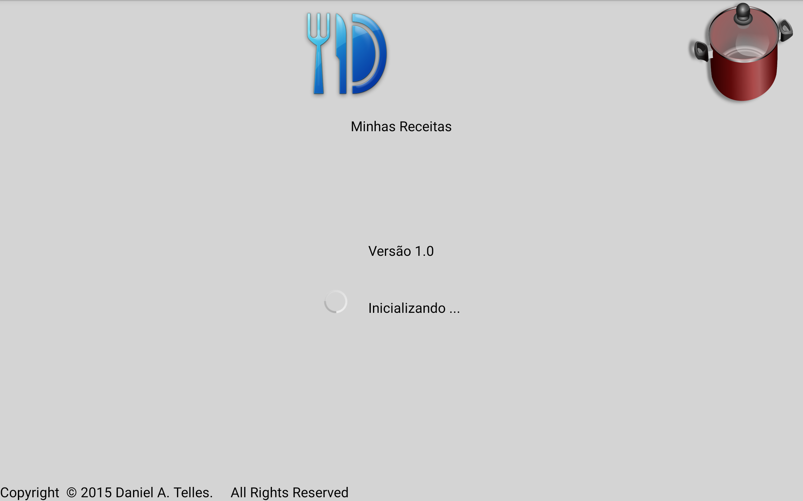
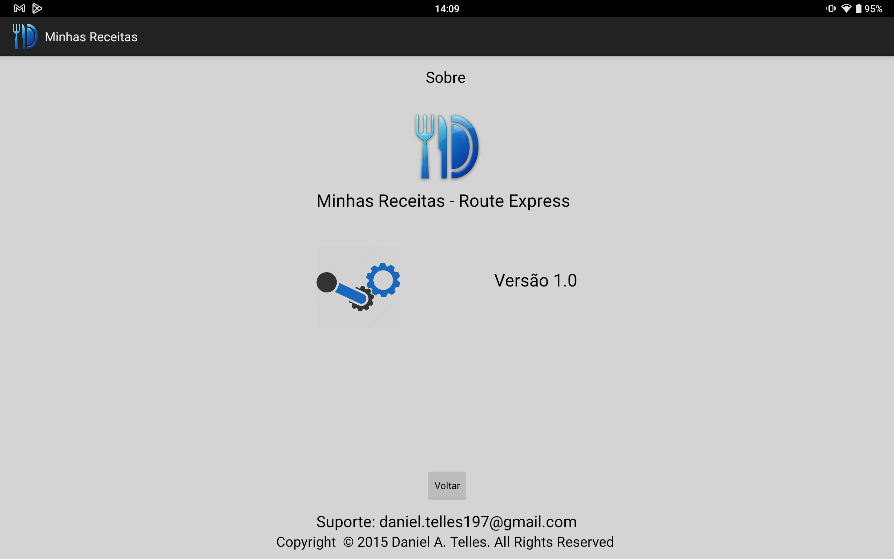
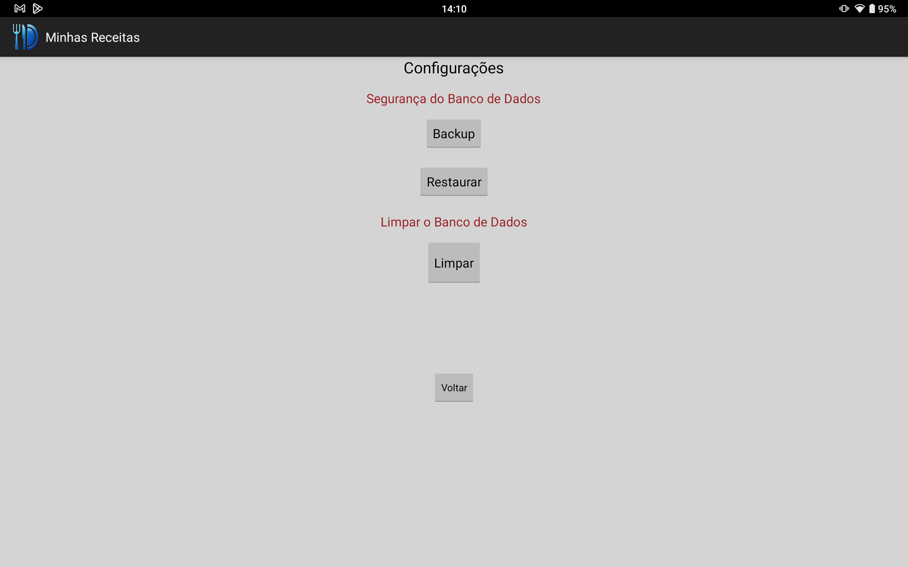
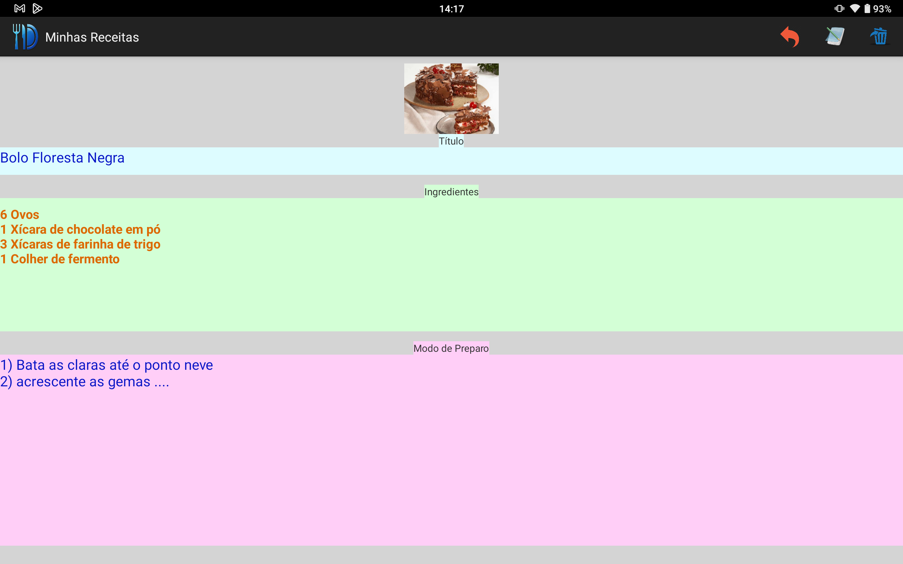

# MinhasReceitas-Android

Projeto Desenvolvido em 2015 - Trabalho do SENAC 

O aplicativo tem as seguintes funções:

1) É possível adicionar receitas com as seguintes informações: Foto, Título, Ingredientes e Modo de Preparo.

2) É possível Editar e Excluir quaisquer receitas.

3) Em Configurações é possível efetuar Backup e Restauração do Banco de Dados.

O App foi desenvolvido no Android Studio V1.5.0.

Para armazenar as informações foi utilizado o SQLite.

